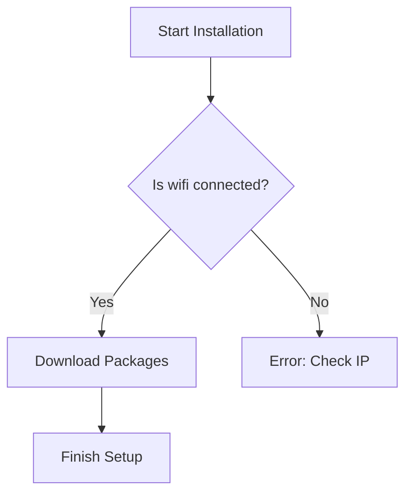

## Markdown Tabs

:::tabs

@tab Step 1: Initialize

Run the `init` command to start.

@tab Step 2: Configure

Edit the `config.yaml` file.

:::


## Comment in a code block

```python
def install_suse():
# we will check the wifi status now
# it will be very easy to finish
status = "checking"
print(status)
```

## Tabs inside a `<details>` Block

<details>

<summary>View Installation Options</summary>

:::tabs

@tab Linux

`sudo zypper install suse`

@tab Windows

`choco install suse`

:::

</details>

## Mermaid Diagram (Flowchart)



**Note**: The system will reboot automatically after this step.

**Note:** Ensure you have backed up the data to a very safe location.

**Important**: Do not turn off the power while we will update the config.

**Important:** This process is very critical for the suse manager id.
